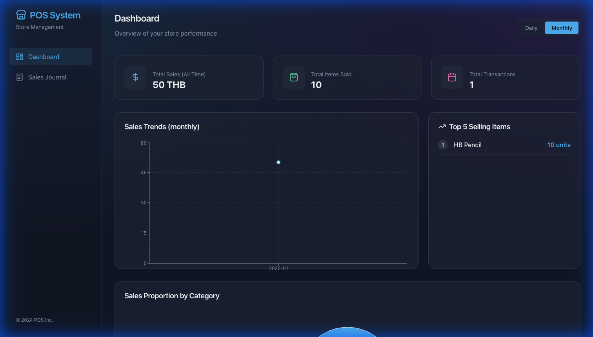
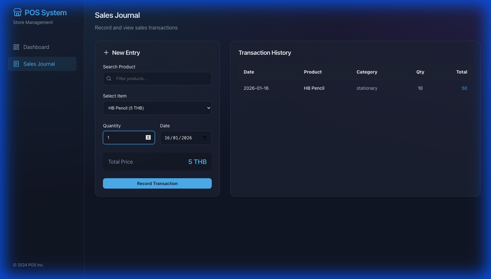

# POS Web Application

A React-based Point of Sale (POS) website for managing sales transactions and visualizing performance.

## 🚀 Live Demo
[GitHub Page URL](https://thananontnc.github.io/POS_Project_Deploy/)

## ✨ Features

### Dashboard
- **Total Sales**: Show total sales of all time.
- **Sales Trends**: Visualize daily and monthly sales performance with interactive line charts.
- **Category Analysis**: Pie chart showing sales distribution by product category.
- **Top Products**: List of top 5 best-selling items.

### Sales Journal
- **Transaction Entry**: Easy-to-use form to record sales.
- **Product Search**: Searchable product dropdown.
- **Auto-Calculation**: Automatic total price calculation based on quantity.
- **History**: view all recorded transactions in a clean table format.

## 🛠 Tech Stack
- **Frontend**: React JS, Vite
- **Styling**: CSS
- **Charts**: Recharts

## 📸 Screenshots

### Dashboard

### Sales Journal

## 👤 Team Members
- 6711424 Thananon Chounudom 
- 6710990 Prathomporn Bunjua 

## Project Status
Ongoing development.
